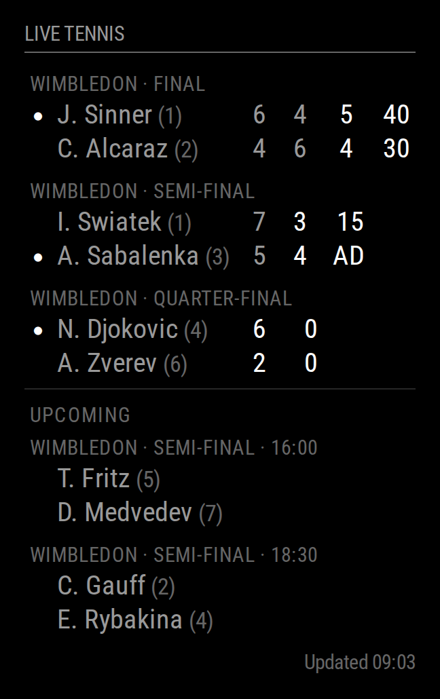

# MMM-LiveTennis

Live ATP/WTA tennis scores for [MagicMirror²](https://magicmirror.builders) — players, set scores, the current game, and who is serving — powered by the [Live Tennis API](https://livetennisapi.com).



## Features

- Live matches with per-set game scores, the current game score (`0/15/30/40/AD`) and a serving indicator.
- Optional **Upcoming** section with start times.
- Filter by tour (ATP / WTA) and cap how many matches are shown.
- Distinct **loading**, **empty**, and **error** states — including a specific message for a rejected key, an exhausted quota, and an unreachable API.
- Keeps the last good scoreboard on screen when a poll fails, marking the header stale rather than blanking the module.
- **The API key is only ever handled server-side, in `node_helper.js`.** It is never rendered and, with either recommended setup below, never reaches the browser at all.
- No runtime dependencies — uses Node's built-in `fetch`.
- Translations: English, German, Spanish, French, Dutch.

## Dependencies

- MagicMirror² `>= 2.30.0`
- Node.js `>= 20`
- A Live Tennis API key — [**get a free one**](https://livetennisapi.com/subscribe/free) (1,000 requests/day)

## Installation

```bash
cd ~/MagicMirror/modules
git clone https://github.com/livetennisapi/MMM-LiveTennis
cd MMM-LiveTennis
npm ci --omit=dev
```

The module has no runtime dependencies, so `npm ci --omit=dev` installs nothing — it is included so the command is safe to run and stays correct if that ever changes.

## Update

```bash
cd ~/MagicMirror/modules/MMM-LiveTennis
git pull
npm ci --omit=dev
```

## Configuration

Add this to the `modules` array in `~/MagicMirror/config/config.js`:

```js
{
  module: "MMM-LiveTennis",
  position: "top_right",
  header: "Live Tennis",
  config: {
    tour: "ATP",
    maximumEntries: 5,
    showUpcoming: true
  }
},
```

Note there is no `apiKey` in that example. See the next section — supplying the key through the environment is both simpler and safer.

## Keeping your API key out of the browser

MagicMirror² serves your `config.js` to the browser. Anything you write literally into `config.js` is readable by anyone who can open your mirror's page. This module therefore supports three ways to supply the key, and resolves them in this order:

### 1. Environment variable (recommended)

Set `LIVETENNIS_API_KEY` in the environment MagicMirror² runs in, and leave `apiKey` out of `config.js` entirely. The key is read directly by `node_helper.js` and never appears in the config at all.

```bash
export LIVETENNIS_API_KEY="your-key-here"
```

With `pm2`, put it in your ecosystem file. With `systemd`, use `Environment=` or `EnvironmentFile=`.

### 2. MagicMirror² secrets (`hideConfigSecrets`)

MagicMirror² 2.35+ can redact `SECRET_*` variables before the config is sent to the browser. Put the value in `config/config.env`:

```ini
SECRET_LIVETENNIS_API_KEY=your-key-here
```

and reference it from `config/config.js`:

```js
let config = {
  hideConfigSecrets: true,
  cors: "disabled",
  modules: [
    {
      module: "MMM-LiveTennis",
      position: "top_right",
      config: {
        apiKey: "${SECRET_LIVETENNIS_API_KEY}"
      }
    }
  ]
};
```

The browser receives the literal string `**SECRET_LIVETENNIS_API_KEY**`; MagicMirror² substitutes the real value inside this module's node helper. Note that this mechanism does not work with `cors: "allowAll"`, and MagicMirror² documents it as **beta**.

### 3. A plain string in `config.js` (works, least private)

```js
config: {
  apiKey: "your-key-here"
}
```

This is the classic MagicMirror² convention and it works. Be aware that MagicMirror² core still serves that value to the browser as part of the global config object. This module removes the key from **its own** module config immediately after handing it to the helper, so a `MM.getModules()` dump or a crash report will not contain it — but it cannot un-send what core already sent. Prefer method 1 or 2 if your mirror is reachable by anyone else.

## Configuration options

| **Option** | **Default** | **Possible values** | **Description** |
| --- | --- | --- | --- |
| `apiKey` | `""` | string | _Optional_ - Your Live Tennis API key. Leave empty and set `LIVETENNIS_API_KEY` in the environment instead (see above). Also accepts a `${SECRET_*}` reference. |
| `apiBase` | `"https://api.livetennisapi.com/api/public/v1"` | string | _Optional_ - API base URL. Only change this to point at a mock or a proxy. |
| `tour` | `""` | `""`, `"ATP"`, `"WTA"` | _Optional_ - Restrict to one tour. Empty shows all tours. |
| `maximumEntries` | `5` | integer > 0 | _Optional_ - Maximum number of live matches to render. |
| `showUpcoming` | `true` | `true`, `false` | _Optional_ - Also show an "Upcoming" section below the live matches. |
| `upcomingEntries` | `3` | integer > 0 | _Optional_ - Maximum number of upcoming matches to render. |
| `showTournament` | `true` | `true`, `false` | _Optional_ - Show the tournament and round caption above each match. |
| `showSets` | `true` | `true`, `false` | _Optional_ - Show per-set game scores. |
| `showGamePoints` | `true` | `true`, `false` | _Optional_ - Show the current game score (`0/15/30/40/AD`). |
| `showServingIndicator` | `true` | `true`, `false` | _Optional_ - Show a dot next to the player currently serving. |
| `showFooter` | `true` | `true`, `false` | _Optional_ - Show an "Updated hh:mm" line under the table. |
| `hideWhenEmpty` | `false` | `true`, `false` | _Optional_ - Render nothing at all when there are no matches, instead of the "No matches in play" message. |
| `updateInterval` | `60000` | integer, ms | _Optional_ - How often to poll. Values below `30000` are raised to `30000` to protect your quota. |
| `retryDelay` | `30000` | integer, ms | _Optional_ - How long to wait before retrying after a failed poll. Minimum `5000`. |
| `animationSpeed` | `1000` | integer, ms | _Optional_ - DOM update animation duration. |
| `tableClass` | `"small"` | `"xsmall"`, `"small"`, `"medium"`, `"large"` | _Optional_ - MagicMirror² text size class for the table. |

### A note on your quota

A free key allows 1,000 requests/day. With `showUpcoming: true` each poll costs **2** requests. The default 60s interval therefore uses roughly `2 × 1440 = 2880` requests/day — more than the free tier. For a free key, either set `showUpcoming: false` (1,440/day) or raise `updateInterval` to `180000` (960/day with upcoming). The module never polls faster than every 30 seconds.

## Rendering states

| State | When | What you see |
| --- | --- | --- |
| Loading | Before the first response | "Loading live scores…" |
| Content | Matches returned | The scoreboard |
| Empty | API returned zero matches | "No matches in play" (or nothing, with `hideWhenEmpty`) |
| No key | No key could be resolved | "No Live Tennis API key configured" |
| Auth error | API returned 401/403 | "Live Tennis API key rejected" |
| Quota error | API returned 429 | "Live Tennis API daily limit reached" |
| Network error | API unreachable | "Cannot reach the Live Tennis API" |
| Stale | A poll failed but old data exists | The old scoreboard, header marked `(stale)`, message below the table |

## API endpoints used

This module only ever issues authenticated `GET` requests to:

- `GET /matches?status=live&tour=&limit=` — the live scoreboard
- `GET /matches?status=upcoming&tour=&limit=` — the upcoming section (only when `showUpcoming` is `true`)

Authentication is the `x-api-key` request header. Full API reference: <https://livetennisapi.com>.

## Development

```bash
npm install          # dev dependencies (eslint)
npm run lint         # eslint
npm test             # syntax check + lint + unit tests
npm run mock         # run the bundled mock API on :8099
```

`npm test` is self-contained: it starts a mock of the Live Tennis API in-process, so it needs no network access and no API key.

To preview the module against the mock without spending any quota, run `npm run mock` and set:

```js
config: {
  apiKey: "anything-non-empty",
  apiBase: "http://127.0.0.1:8099/s/ok/api/public/v1"
}
```

The mock also serves `/s/empty/…`, `/s/slow/…`, `/s/badkey/…`, `/s/ratelimit/…` and `/s/boom/…` so you can see each error state.

## Troubleshooting

**"No Live Tennis API key configured"** — the helper could not resolve a key. Check `LIVETENNIS_API_KEY` is exported in the environment MagicMirror² actually runs in (a key exported in your shell is not visible to a `systemd` or `pm2` service). If you used a `${SECRET_*}` reference, confirm `hideConfigSecrets: true` is set and `config/config.env` contains the variable.

**"Live Tennis API key rejected"** — the API returned 401/403. Verify the key at <https://livetennisapi.com>.

**Nothing renders at all** — check `npm run config:check` in your MagicMirror² folder, and look for `MMM-LiveTennis` lines in the MagicMirror² log.

**Two instances show the same data** — that is expected if they have the same config; each instance is polled and updated independently.

## Disclosure

- **Vendor-authored.** This module is written and maintained by the Live Tennis API team, the operator of the commercial API it consumes. We have an obvious interest in you using our API. The module is MIT licensed, contains no telemetry, and talks to no host other than the `apiBase` you configure. A free tier (1,000 requests/day) is available and is enough to run this module continuously with the settings suggested above.
- **AI-assisted.** This module was written with AI assistance (Anthropic Claude). It was verified end to end before release against a local mock of the API in a real MagicMirror² v2.37.0 install: every render state was checked in a headless browser, the unit suite passes, and the client-side state was audited to confirm the API key does not leak into the page. It has **not** yet been run against a live tournament feed with a production key — please open an issue if you hit a data shape this module renders badly.

## License

[MIT](LICENSE) © Live Tennis API

## Changelog

See [CHANGELOG.md](CHANGELOG.md).

## Affiliate program

Know developers who need tennis data? The [affiliate program](https://affiliates.livetennisapi.com/program) pays 51% recurring commission for the life of every referred subscription — 30-day cookie, and the people you refer get 10% off.
